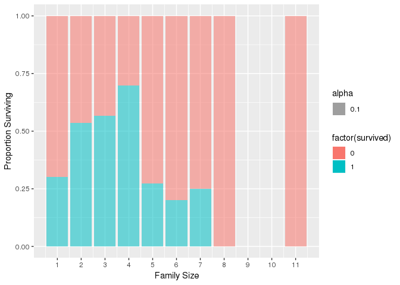
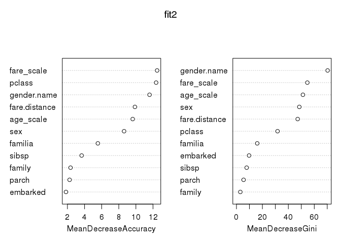
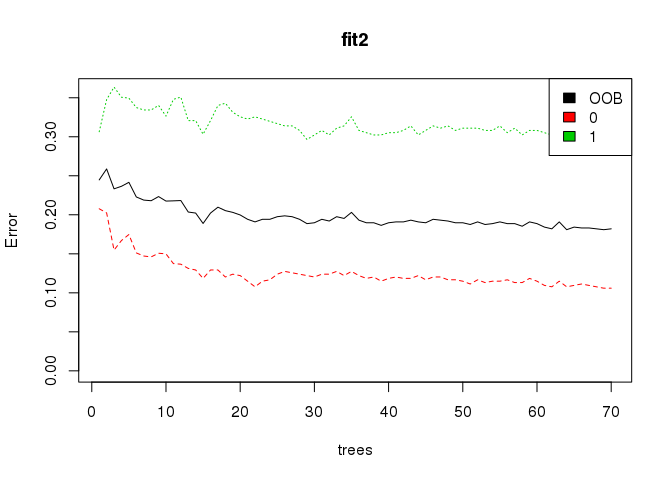
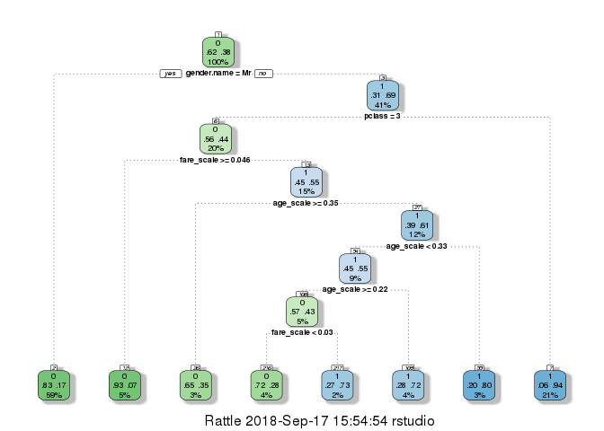

Titanic
================
Niket

------------------------------------------------------------------------

Titanic Dataset

------------------------------------------------------------------------

``` r
titanic <- read.csv('titanic3.csv', stringsAsFactors = FALSE, header = TRUE, na.strings = c("NA",""," ","."))
```

Why ‘stringsAsFactors = FALSE’? Character variables passed to data.frame are converted to factor columns unless protected by I or argument stringsAsFactors is false.

-   We have to predict the fate of the passengers aboard the RMS Titanic, which famously sank in the Atlantic ocean during its maiden voyage from the UK to New York City after colliding with an iceberg.

-   The disaster is famous for saving “women and children first”.

-   With an inadequate number of lifeboats available only a fraction of the passengers survived,

``` r
str(titanic) # str
```

    ## 'data.frame':    1310 obs. of  14 variables:
    ##  $ pclass   : int  1 1 1 1 1 1 1 1 1 1 ...
    ##  $ survived : int  1 1 0 0 0 1 1 0 1 0 ...
    ##  $ name     : chr  "Allen, Miss. Elisabeth Walton" "Allison, Master. Hudson Trevor" "Allison, Miss. Helen Loraine" "Allison, Mr. Hudson Joshua Creighton" ...
    ##  $ sex      : chr  "female" "male" "female" "male" ...
    ##  $ age      : num  29 0.917 2 30 25 ...
    ##  $ sibsp    : int  0 1 1 1 1 0 1 0 2 0 ...
    ##  $ parch    : int  0 2 2 2 2 0 0 0 0 0 ...
    ##  $ ticket   : chr  "24160" "113781" "113781" "113781" ...
    ##  $ fare     : num  211 152 152 152 152 ...
    ##  $ cabin    : chr  "B5" "C22 C26" "C22 C26" "C22 C26" ...
    ##  $ embarked : chr  "S" "S" "S" "S" ...
    ##  $ boat     : chr  "2" "11" NA NA ...
    ##  $ body     : int  NA NA NA 135 NA NA NA NA NA 22 ...
    ##  $ home.dest: chr  "St Louis, MO" "Montreal, PQ / Chesterville, ON" "Montreal, PQ / Chesterville, ON" "Montreal, PQ / Chesterville, ON" ...

``` r
table(titanic$survived) # table of survived people, 0 = Died, 1 = Survived
```

    ## 
    ##   0   1 
    ## 809 500

``` r
prop.table(table(titanic$survived))
```

    ## 
    ##        0        1 
    ## 0.618029 0.381971

``` r
# Most people died in train set, so it should be same in the test set too
```

------------------------------------------------------------------------

``` r
titanic$survived <- factor(titanic$survived)
titanic$sex <- factor(titanic$sex)
titanic$pclass <- factor(titanic$pclass)
titanic$embarked <- factor(titanic$embarked)
```

``` r
sapply(titanic, function(x){sum(is.na(x))})
```

    ##    pclass  survived      name       sex       age     sibsp     parch 
    ##         1         1         1         1       264         1         1 
    ##    ticket      fare     cabin  embarked      boat      body home.dest 
    ##         1         2      1015         3       824      1189       565

Dropping columns which are not that relevant

``` r
titanic$home.dest <- NULL
titanic$body <- NULL
titanic$boat <- NULL
titanic$cabin <- NULL
```

Looking at missing value in pclass

``` r
which(is.na(titanic$pclass) == TRUE)
```

    ## [1] 1310

``` r
titanic[1310,]
```

    ##      pclass survived name  sex age sibsp parch ticket fare embarked
    ## 1310   <NA>     <NA> <NA> <NA>  NA    NA    NA   <NA>   NA     <NA>

A blank row, let's drop it

``` r
titanic <- titanic[-1310,]
```

------------------------------------------------------------------------

Create LM models for predicting missing values in AGE and FARE

``` r
age.mod <- lm(age ~ pclass + sex + sibsp + parch + fare, data = titanic)
fare.mod<- lm(fare ~ pclass + sex + sibsp + parch + age, data = titanic)
```

Replace missing values in AGE and FARE with prediction

``` r
titanic$age[is.na(titanic$age)] <- predict(age.mod, titanic)[is.na(titanic$age)]
titanic$fare[is.na(titanic$fare)] <- predict(fare.mod, titanic)[is.na(titanic$fare)]
```

------------------------------------------------------------------------

Replace missing values in embarked with most popular

``` r
prop.table(table(titanic$embarked))
```

    ## 
    ##          C          Q          S 
    ## 0.20657995 0.09410865 0.69931140

``` r
table(titanic$pclass, titanic$embarked)
```

    ##    
    ##       C   Q   S
    ##   1 141   3 177
    ##   2  28   7 242
    ##   3 101 113 495

``` r
titanic$embarked[is.na(titanic$embarked)] <- "S"
titanic$embarked <- factor(titanic$embarked)
```

------------------------------------------------------------------------

Let's look at the titles of passengers

``` r
titanic$title <- gsub('(.*, )|(\\..*)', '', titanic$name)
```

``` r
table(titanic$sex, titanic$title)
```

    ##         
    ##          Capt Col Don Dona  Dr Jonkheer Lady Major Master Miss Mlle Mme
    ##   female    0   0   0    1   1        0    1     0      0  260    2   1
    ##   male      1   4   1    0   7        1    0     2     61    0    0   0
    ##         
    ##           Mr Mrs  Ms Rev Sir the Countess
    ##   female   0 197   2   0   0            1
    ##   male   757   0   0   8   1            0

Look for the female doctor

``` r
titanic[titanic$sex == "female" & titanic$title == "Dr",]
```

    ##     pclass survived                        name    sex age sibsp parch
    ## 182      1        1 Leader, Dr. Alice (Farnham) female  49     0     0
    ##     ticket    fare embarked title
    ## 182  17465 25.9292        S    Dr

Create “gender.name” variable

``` r
library(stringr)
titanic$gender.name <- 0
```

``` r
titanic$gender.name[!is.na(str_extract(titanic$name, "Capt"))] <- "Mr"
titanic$gender.name[!is.na(str_extract(titanic$name, "Col"))] <- "Mr"
titanic$gender.name[!is.na(str_extract(titanic$name, "Don"))] <- "Mr"
titanic$gender.name[!is.na(str_extract(titanic$name, "Dona"))] <- "Mrs"
titanic$gender.name[!is.na(str_extract(titanic$name, "Dr"))] <- "Mr"
titanic$gender.name[!is.na(str_extract(titanic$name, "Jonkheer"))] <- "Mr"
titanic$gender.name[!is.na(str_extract(titanic$name, "Lady"))] <- "Mrs"
titanic$gender.name[!is.na(str_extract(titanic$name, "Major"))] <- "Mr"
titanic$gender.name[!is.na(str_extract(titanic$name, "Master"))] <- "Mast"
titanic$gender.name[!is.na(str_extract(titanic$name, "Miss"))] <- "Miss"
titanic$gender.name[!is.na(str_extract(titanic$name, "Mlle"))] <- "Miss"
titanic$gender.name[!is.na(str_extract(titanic$name, "Mme"))] <- "Mrs"
titanic$gender.name[!is.na(str_extract(titanic$name, "Mr"))] <- "Mr"
titanic$gender.name[!is.na(str_extract(titanic$name, "Mrs"))] <- "Mrs"
titanic$gender.name[!is.na(str_extract(titanic$name, "Ms"))] <- "Miss"
titanic$gender.name[!is.na(str_extract(titanic$name, "Rev"))] <- "Mr"
titanic$gender.name[!is.na(str_extract(titanic$name, "Sir"))] <- "Mr"
titanic$gender.name[!is.na(str_extract(titanic$name, "the Countess"))] <- "Mrs"
```

Change female doctor to Mrs

``` r
titanic$gender.name[182] <- "Mrs"
```

``` r
table(titanic$sex, titanic$gender.name)
```

    ##         
    ##          Mast Miss  Mr Mrs
    ##   female    0  261   0 205
    ##   male     61    0 782   0

``` r
titanic$gender.name <- factor(titanic$gender.name)
```

------------------------------------------------------------------------

Are those who pay less than the average for a ticket less likely to survive? Mean fare for each pclass

``` r
class1 <- subset(titanic, pclass == 1)
class2 <- subset(titanic, pclass == 2)
class3 <- subset(titanic, pclass == 3)
fare1 <- mean(class1$fare, na.rm = TRUE)
fare2 <- mean(class2$fare, na.rm = TRUE)
fare3 <- mean(class3$fare, na.rm = TRUE)
```

Create fare\_avg column

``` r
titanic$fare_avg[titanic$pclass == 1] <- fare1
titanic$fare_avg[titanic$pclass == 2] <- fare2
titanic$fare_avg[titanic$pclass == 3] <- fare3
```

Create fare-distance metric for titanic fare-distance = fare - mean(fare of pclass)

``` r
titanic <- transform(titanic, fare.distance = fare - fare_avg)
titanic <- titanic[, !names(titanic) %in% c("fare_avg")]
```

Add family column

``` r
titanic$family <- NA
titanic$family[which(titanic$sibsp != 0 | titanic$parch != 0)] <- 1
titanic$family[which(titanic$sibsp == 0 & titanic$parch == 0)] <- 0
```

``` r
table(titanic$family)
```

    ## 
    ##   0   1 
    ## 790 519

``` r
titanic$family <- as.factor(titanic$family)
```

Create a family size variable including the passenger themselves

``` r
titanic$familia <- titanic$sibsp + titanic$parch + 1
```

------------------------------------------------------------------------

``` r
library(ggplot2)
```

``` r
ggplot(titanic, aes(x = familia, fill = factor(survived))) +
  geom_bar(position = "fill", aes(alpha = .1)) +
  scale_x_continuous(breaks=c(1:11)) +
  labs(x = 'Family Size', y = 'Proportion Surviving')
```



------------------------------------------------------------------------

Scale the non factors

``` r
titanic$age_scale <- (titanic$age - min(titanic$age))/(max(titanic$age - min(titanic$age)))
titanic$fare_scale <- (titanic$fare - min(titanic$fare))/(max(titanic$fare - min(titanic$fare)))
```

------------------------------------------------------------------------

------------------------------------------------------------------------

Prediction

``` r
set.seed(1234)
oneortwo <- sample(1:2 , length(titanic$survived), replace = TRUE, prob=c(0.68, 0.32)) # generating random values and storing them
```

``` r
# create train data frame
train <- titanic[oneortwo == 1, ]

# create test data frame
test <- titanic[oneortwo == 2, ]
```

------------------------------------------------------------------------

Logistic Regression

Create probit with SEX, PCLASS, FARE, and AGE

``` r
logit <- glm(survived ~ gender.name + pclass + age + fare + fare.distance, data = train,
              family = binomial(link = "logit"))
```

``` r
logit_age <- glm(survived ~ gender.name + pclass + age + fare_scale + familia, data = train[!(is.na(train$age)), ],
                 family = binomial(link = "logit"))
```

``` r
summary(logit)
```

    ## 
    ## Call:
    ## glm(formula = survived ~ gender.name + pclass + age + fare + 
    ##     fare.distance, family = binomial(link = "logit"), data = train)
    ## 
    ## Deviance Residuals: 
    ##     Min       1Q   Median       3Q      Max  
    ## -2.4084  -0.6344  -0.4001   0.6296   2.4363  
    ## 
    ## Coefficients: (1 not defined because of singularities)
    ##                  Estimate Std. Error z value Pr(>|z|)    
    ## (Intercept)      2.290105   0.489382   4.680 2.87e-06 ***
    ## gender.nameMiss  0.912030   0.400042   2.280 0.022617 *  
    ## gender.nameMr   -1.503383   0.420090  -3.579 0.000345 ***
    ## gender.nameMrs   1.524430   0.460816   3.308 0.000939 ***
    ## pclass2         -1.525232   0.306407  -4.978 6.43e-07 ***
    ## pclass3         -2.568465   0.301154  -8.529  < 2e-16 ***
    ## age             -0.024820   0.008622  -2.879 0.003992 ** 
    ## fare            -0.002038   0.002001  -1.019 0.308381    
    ## fare.distance          NA         NA      NA       NA    
    ## ---
    ## Signif. codes:  0 '***' 0.001 '**' 0.01 '*' 0.05 '.' 0.1 ' ' 1
    ## 
    ## (Dispersion parameter for binomial family taken to be 1)
    ## 
    ##     Null deviance: 1198.22  on 900  degrees of freedom
    ## Residual deviance:  810.37  on 893  degrees of freedom
    ## AIC: 826.37
    ## 
    ## Number of Fisher Scoring iterations: 5

``` r
model <- 'glm(survived ~ gender.name + pclass + age + fare, data = train, family = binomial(link = "logit"))'
# save model as string
```

``` r
my_model <- glm(survived ~ pclass + sex + age_scale + sibsp + parch + fare_scale + embarked + gender.name + fare.distance + family + familia, data = train, family = binomial(link = "logit"))
```

Make our prediction on the TRAIN data set

``` r
survived_pred <- predict(logit, train, type = "response")
```

    ## Warning in predict.lm(object, newdata, se.fit, scale = 1, type =
    ## ifelse(type == : prediction from a rank-deficient fit may be misleading

``` r
survived_pred[survived_pred >= 0.5] <- 1
survived_pred[survived_pred < 0.5] <- 0

survived_pred3 <- predict(my_model, train, type = "response")
```

    ## Warning in predict.lm(object, newdata, se.fit, scale = 1, type =
    ## ifelse(type == : prediction from a rank-deficient fit may be misleading

``` r
survived_pred3[survived_pred3 >= 0.5] <- 1
survived_pred3[survived_pred3 < 0.5] <- 0

survived_pred2 <- predict(logit, test, type = "response")
```

    ## Warning in predict.lm(object, newdata, se.fit, scale = 1, type =
    ## ifelse(type == : prediction from a rank-deficient fit may be misleading

``` r
survived_pred2[survived_pred2 >= 0.5] <- 1
survived_pred2[survived_pred2 < 0.5] <- 0

survived_pred3_2 <- predict(my_model, test, type = "response")
```

    ## Warning in predict.lm(object, newdata, se.fit, scale = 1, type =
    ## ifelse(type == : prediction from a rank-deficient fit may be misleading

``` r
survived_pred3_2[survived_pred3_2 >= 0.5] <- 1
survived_pred3_2[survived_pred3_2 < 0.5] <- 0
```

``` r
results <- data.frame(survived_pred2, test$survived)
results3 <- data.frame(survived_pred3_2, test$survived)
```

``` r
require(caret)
```

    ## Loading required package: caret

    ## Loading required package: lattice

``` r
confusionMatrix(table(results))
```

    ## Confusion Matrix and Statistics
    ## 
    ##               test.survived
    ## survived_pred2   0   1
    ##              0 221  51
    ##              1  31 105
    ##                                           
    ##                Accuracy : 0.799           
    ##                  95% CI : (0.7568, 0.8368)
    ##     No Information Rate : 0.6176          
    ##     P-Value [Acc > NIR] : 2.323e-15       
    ##                                           
    ##                   Kappa : 0.5638          
    ##  Mcnemar's Test P-Value : 0.03589         
    ##                                           
    ##             Sensitivity : 0.8770          
    ##             Specificity : 0.6731          
    ##          Pos Pred Value : 0.8125          
    ##          Neg Pred Value : 0.7721          
    ##              Prevalence : 0.6176          
    ##          Detection Rate : 0.5417          
    ##    Detection Prevalence : 0.6667          
    ##       Balanced Accuracy : 0.7750          
    ##                                           
    ##        'Positive' Class : 0               
    ## 

``` r
confusionMatrix(table(results3))
```

    ## Confusion Matrix and Statistics
    ## 
    ##                 test.survived
    ## survived_pred3_2   0   1
    ##                0 217  42
    ##                1  35 114
    ##                                           
    ##                Accuracy : 0.8113          
    ##                  95% CI : (0.7699, 0.8481)
    ##     No Information Rate : 0.6176          
    ##     P-Value [Acc > NIR] : <2e-16          
    ##                                           
    ##                   Kappa : 0.597           
    ##  Mcnemar's Test P-Value : 0.4941          
    ##                                           
    ##             Sensitivity : 0.8611          
    ##             Specificity : 0.7308          
    ##          Pos Pred Value : 0.8378          
    ##          Neg Pred Value : 0.7651          
    ##              Prevalence : 0.6176          
    ##          Detection Rate : 0.5319          
    ##    Detection Prevalence : 0.6348          
    ##       Balanced Accuracy : 0.7959          
    ##                                           
    ##        'Positive' Class : 0               
    ## 

------------------------------------------------------------------------

Random Forest

``` r
library(party)
```

    ## Loading required package: grid

    ## Loading required package: mvtnorm

    ## Loading required package: modeltools

    ## Loading required package: stats4

    ## Loading required package: strucchange

    ## Loading required package: zoo

    ## 
    ## Attaching package: 'zoo'

    ## The following objects are masked from 'package:base':
    ## 
    ##     as.Date, as.Date.numeric

    ## Loading required package: sandwich

    ## 
    ## Attaching package: 'strucchange'

    ## The following object is masked from 'package:stringr':
    ## 
    ##     boundary

``` r
library(randomForest)
```

    ## randomForest 4.6-14

    ## Type rfNews() to see new features/changes/bug fixes.

    ## 
    ## Attaching package: 'randomForest'

    ## The following object is masked from 'package:ggplot2':
    ## 
    ##     margin

``` r
library(rpart)
```

``` r
set.seed(123)
fit1 <- cforest(survived ~ pclass + sex + age_scale + sibsp + parch + fare_scale + embarked + gender.name + fare.distance + family + familia, data = train, controls = cforest_unbiased(ntree = 200, mtry = 3)) # Conditional inference trees are able to handle factors with more levels than Random Forests can.

set.seed(123)
fit2 <- randomForest(survived ~ pclass + sex + age_scale + sibsp + parch + fare_scale + embarked + gender.name + fare.distance + family + familia, data=train, importance=TRUE, ntree= 70)

set.seed(123)
fit3 <- rpart(survived ~ pclass + sex + age_scale + sibsp + parch + fare_scale + embarked + gender.name + fare.distance + family + familia, data = train, method = "class")
```

``` r
varImpPlot(fit2)
```



``` r
# Show model error
plot(fit2, ylim = c(0,0.36))
legend('topright', colnames(fit2$err.rate), col=1:3, fill=1:3)
```



``` r
# For better insights from above plot we get these packages.
library(rattle)
```

    ## Rattle: A free graphical interface for data science with R.
    ## Version 5.2.0 Copyright (c) 2006-2018 Togaware Pty Ltd.
    ## Type 'rattle()' to shake, rattle, and roll your data.

    ## 
    ## Attaching package: 'rattle'

    ## The following object is masked from 'package:randomForest':
    ## 
    ##     importance

``` r
library(rpart.plot)
library(RColorBrewer)
```

``` r
fancyRpartPlot(fit3) # This gives better plot
```



``` r
prediction4 <- predict(fit2, test[-2], OOB = TRUE, type = "response")
results4 <- data.frame(prediction4, test$survived)
confusionMatrix(table(results4))
```

    ## Confusion Matrix and Statistics
    ## 
    ##            test.survived
    ## prediction4   0   1
    ##           0 218  54
    ##           1  34 102
    ##                                           
    ##                Accuracy : 0.7843          
    ##                  95% CI : (0.7412, 0.8233)
    ##     No Information Rate : 0.6176          
    ##     P-Value [Acc > NIR] : 4.092e-13       
    ##                                           
    ##                   Kappa : 0.5319          
    ##  Mcnemar's Test P-Value : 0.04283         
    ##                                           
    ##             Sensitivity : 0.8651          
    ##             Specificity : 0.6538          
    ##          Pos Pred Value : 0.8015          
    ##          Neg Pred Value : 0.7500          
    ##              Prevalence : 0.6176          
    ##          Detection Rate : 0.5343          
    ##    Detection Prevalence : 0.6667          
    ##       Balanced Accuracy : 0.7595          
    ##                                           
    ##        'Positive' Class : 0               
    ## 

------------------------------------------------------------------------

------------------------------------------------------------------------
