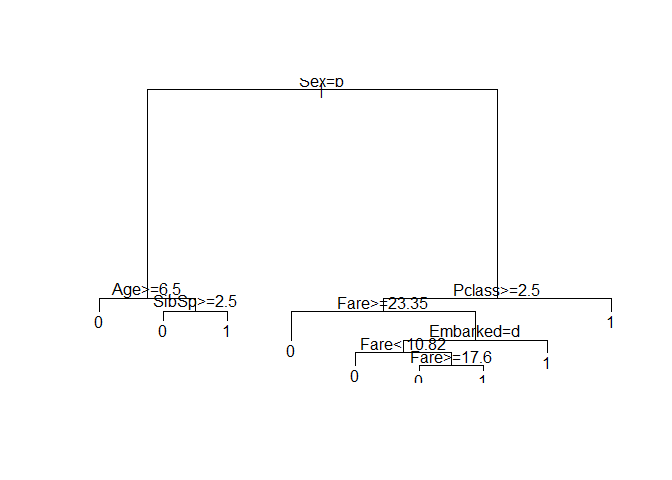
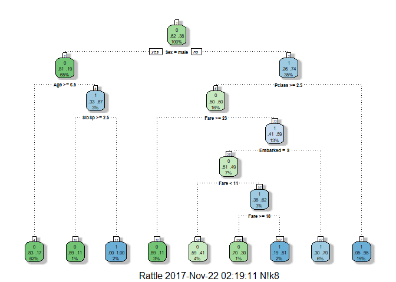
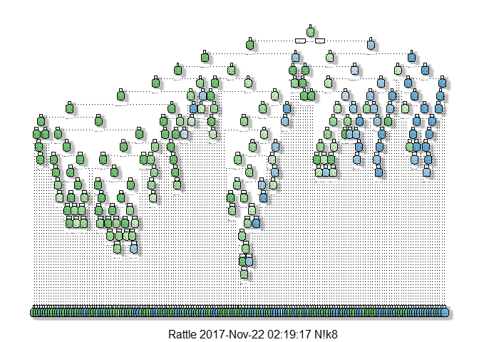
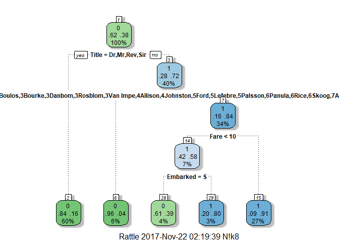
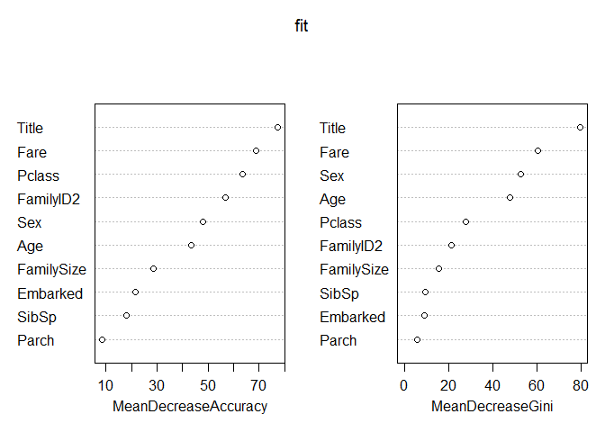

Titanic
================
Niket

------------------------------------------------------------------------

Kaggle - Titanic Dataset With R

------------------------------------------------------------------------

``` r
train <- read.csv("train.csv", header = T) # import train.csv
test <- read.csv("test.csv", header = T) # import test.csv
```

``` r
str(train) # str
```

    ## 'data.frame':    891 obs. of  12 variables:
    ##  $ PassengerId: int  1 2 3 4 5 6 7 8 9 10 ...
    ##  $ Survived   : int  0 1 1 1 0 0 0 0 1 1 ...
    ##  $ Pclass     : int  3 1 3 1 3 3 1 3 3 2 ...
    ##  $ Name       : Factor w/ 891 levels "Abbing, Mr. Anthony",..: 109 191 358 277 16 559 520 629 417 581 ...
    ##  $ Sex        : Factor w/ 2 levels "female","male": 2 1 1 1 2 2 2 2 1 1 ...
    ##  $ Age        : num  22 38 26 35 35 NA 54 2 27 14 ...
    ##  $ SibSp      : int  1 1 0 1 0 0 0 3 0 1 ...
    ##  $ Parch      : int  0 0 0 0 0 0 0 1 2 0 ...
    ##  $ Ticket     : Factor w/ 681 levels "110152","110413",..: 524 597 670 50 473 276 86 396 345 133 ...
    ##  $ Fare       : num  7.25 71.28 7.92 53.1 8.05 ...
    ##  $ Cabin      : Factor w/ 148 levels "","A10","A14",..: 1 83 1 57 1 1 131 1 1 1 ...
    ##  $ Embarked   : Factor w/ 4 levels "","C","Q","S": 4 2 4 4 4 3 4 4 4 2 ...

``` r
table(train$Survived) # table of survived people, 0 = Died, 1 = Survived
```

    ## 
    ##   0   1 
    ## 549 342

``` r
prop.table(table(train$Survived))
```

    ## 
    ##         0         1 
    ## 0.6161616 0.3838384

``` r
# Most people died in train set, so it should be same in the test set too
```

``` r
test$Survived <- rep(0, 418) # Create a new column survived in test.csv and fill it with 0(Dead) 418 times
```

``` r
submit <- data.frame(PassengerId = test$PassengerId, Survived = test$Survived) # Store PassengerId and Survived into submit data frame.
```

``` r
write.csv(submit, file = "died.csv", row.names = F) # Create a csv file with submit, this file contains PassengerId and Survival.
```

62% of our predictions are correct.

------------------------------------------------------------------------

------------------------------------------------------------------------

``` r
# “Women and children ” were saved mostly at this incident. So we will look at them.
```

``` r
summary(train$Sex)
```

    ## female   male 
    ##    314    577

``` r
# majority were male.
```

``` r
prop.table(table(train$Sex, train$Survived)) # This dosent gives the proper proportion.
```

    ##         
    ##                   0          1
    ##   female 0.09090909 0.26150393
    ##   male   0.52525253 0.12233446

``` r
prop.table(table(train$Sex, train$Survived),1) # This considers total proportion by rows.
```

    ##         
    ##                  0         1
    ##   female 0.2579618 0.7420382
    ##   male   0.8110919 0.1889081

``` r
# We can see that 81% of the male died, but only 25% of the females died.
```

``` r
test$Survived <- 0 # Instead of repeating 0 for all values like before, we assign 0 to whole column.
test$Survived[test$Sex == 'female'] <- 1 # We here state that every women survived.
```

``` r
submit <- data.frame(PassengerId = test$PassengerId, Survived = test$Survived) # Store PassengerId and Survived into submit data frame.
write.csv(submit, file = "died.csv", row.names = F) # Upadted the previous result.
```

76.555% of our predictions are correct.

------------------------------------------------------------------------

------------------------------------------------------------------------

``` r
train$Child <- 0 # Created a new variable for Child.
train$Child[train$Age < 18] <- 1 # To show whether the passenger is below 18 years.
```

``` r
aggregate(Survived ~ Child + Sex, data = train, FUN = sum)
```

    ##   Child    Sex Survived
    ## 1     0 female      195
    ## 2     1 female       38
    ## 3     0   male       86
    ## 4     1   male       23

``` r
# With sum function we get only the number of survivors, but we need total number of people in each subset.
```

``` r
aggregate(Survived ~ Child + Sex, data = train, FUN = length) # This fun= length gives the number of people in each subset.
```

    ##   Child    Sex Survived
    ## 1     0 female      259
    ## 2     1 female       55
    ## 3     0   male      519
    ## 4     1   male       58

``` r
aggregate(Survived ~ Child + Sex, data = train, FUN = function(x) {sum(x)/length(x)})
```

    ##   Child    Sex  Survived
    ## 1     0 female 0.7528958
    ## 2     1 female 0.6909091
    ## 3     0   male 0.1657033
    ## 4     1   male 0.3965517

``` r
# This gives us the proportion by total survived/ total.
# We see that if passengers were female they survived, so passenger age dosen't matter.
```

``` r
# Fare is a continuous variable,bin the fares into less than $10, between $10 and $20, $20 to $30 and more than $30 and store it to a new variable
train$Fare2 <- '30+'
train$Fare2[train$Fare < 30 & train$Fare >= 20] <- '20-30'
train$Fare2[train$Fare < 20 & train$Fare >=10] <- '10-20'
train$Fare2[train$Fare < 10] <- '10'
```

``` r
aggregate(Survived ~ Fare2 + Pclass + Sex, data = train, FUN =  function(x) {sum(x)/length(x)}) # check survived with Fare2 and Passenger class and Sex.
```

    ##    Fare2 Pclass    Sex  Survived
    ## 1  20-30      1 female 0.8333333
    ## 2    30+      1 female 0.9772727
    ## 3  10-20      2 female 0.9142857
    ## 4  20-30      2 female 0.9000000
    ## 5    30+      2 female 1.0000000
    ## 6     10      3 female 0.5937500
    ## 7  10-20      3 female 0.5813953
    ## 8  20-30      3 female 0.3333333
    ## 9    30+      3 female 0.1250000
    ## 10    10      1   male 0.0000000
    ## 11 20-30      1   male 0.4000000
    ## 12   30+      1   male 0.3837209
    ## 13    10      2   male 0.0000000
    ## 14 10-20      2   male 0.1587302
    ## 15 20-30      2   male 0.1600000
    ## 16   30+      2   male 0.2142857
    ## 17    10      3   male 0.1115385
    ## 18 10-20      3   male 0.2368421
    ## 19 20-30      3   male 0.1250000
    ## 20   30+      3   male 0.2400000

``` r
# Again male didn't do well regardless of class or fare.
# Also females in Pclass 3 didn't do well.
# Also female in Pclass 3 with 30+ fare might have died as their cabin were located close to iceberg.
```

``` r
test$Survived <- 0
test$Survived[test$Sex == 'female'] <- 1
test$Survived[test$Sex == 'female' & test$Pclass == 3 & test$Fare >= 20] <- 0
```

``` r
submit <- data.frame(PassengerId = test$PassengerId, Survived = test$Survived) # Store PassengerId and Survived into submit data frame.
write.csv(submit, file = "died.csv", row.names = F) # Upadted the previous result.
```

77.990% of our predictions are correct.

------------------------------------------------------------------------

------------------------------------------------------------------------

``` r
library(rpart) #rpart for “Recursive Partitioning and Regression Trees” and uses the CART decision tree algorithm.
```

``` r
fit <- rpart(Survived ~ Pclass + Sex + Age + SibSp + Parch + Fare + Embarked, data = train, method = "class") # If you wanted to predict a continuous variable, such as age, you may use method = "anova". This would generate decimal quantities for you. But here, we just want a one or a zero, so method= "class".
```

``` r
# Examine fit
plot(fit)
text(fit)
```



``` r
# For better insights from above plot we get these packages.
library(rattle)
```

    ## Rattle: A free graphical interface for data science with R.
    ## Version 5.1.0 Copyright (c) 2006-2017 Togaware Pty Ltd.
    ## Type 'rattle()' to shake, rattle, and roll your data.

``` r
library(rpart.plot)
library(RColorBrewer)
```

``` r
fancyRpartPlot(fit) # This gives better plot
```



``` r
Prediction <- predict(fit, test, type = "class") # rpart’s predict function, function to model fit object, which contains all of the decisions we see above, class method (for ones and zeros output) .
```

``` r
submit <- data.frame(PassengerId = test$PassengerId, Survived = Prediction) # Store PassengerId and Survived into submit data frame.
write.csv(submit, file = "died.csv", row.names = F) # Upadted the previous result.
```

78.469% of our predictions are correct.

------------------------------------------------------------------------

``` r
fit <- rpart(Survived ~ Pclass + Sex + Age + SibSp + Parch + Fare + Embarked, data = train, method = "class", control = rpart.control(minsplit = 2, cp = 0))  # cp parameter is the metric that stops splits that aren’t deemed important enough, minsplit which governs how many passengers must sit in a bucket before even looking for a split. Max both out and reduce cp to zero and minsplit to 2.
```

``` r
fancyRpartPlot(fit)
```

    ## Warning: labs do not fit even at cex 0.15, there may be some overplotting



74.163% of our predictions are correct.

``` r
# Last model did better than this.
# ---------Overfitting
```

------------------------------------------------------------------------

------------------------------------------------------------------------

``` r
# we create new data frame combi so that we can work on test and train set together, but first we need to have same number of columns in both. we use rbind to merge them.
test$Survived <- NA
test$Child <- NA
test$Fare2 <- NA
combi <- rbind(train, test)
```

``` r
# let us see that can we use some information from the Name column to our use.
train$Name[1]
```

    ## [1] Braund, Mr. Owen Harris
    ## 891 Levels: Abbing, Mr. Anthony ... Zimmerman, Mr. Leo

``` r
# we see that starting has a title Mr. , this can be used for our prediction, in dataset we see more titles including Miss, Mrs, Master, Countess..
```

``` r
# we see that Name variable has factor data type, but we need it as a string data type, so we change it.
combi$Name <- as.character(combi$Name)
combi$Name[1]
```

    ## [1] "Braund, Mr. Owen Harris"

``` r
# we have changed the data type to string, no more levels.
```

``` r
strsplit(combi$Name[1], split = '[,.]')
```

    ## [[1]]
    ## [1] "Braund"       " Mr"          " Owen Harris"

``` r
strsplit(combi$Name[1], split = '[,.]')[[1]]
```

    ## [1] "Braund"       " Mr"          " Owen Harris"

``` r
strsplit(combi$Name[1], split = '[,.]')[[1]][2]
```

    ## [1] " Mr"

``` r
# So we are able to extract only title Mr from whole string.
```

``` r
# combi$Title <- strsplit(combi$Name, split='[,.]')[[1]][2] # This dosen't work as it takes all titles as Mr.
```

``` r
combi$Title <- sapply(combi$Name, FUN = function(x) {strsplit(x, '[,.]')[[1]][2]})
# This splits and stores the titles in the Title data frame.
```

``` r
combi$Title <- sub(' ', '', combi$Title) # As we were seeing a space before the titles we can substitute space with no space.
```

``` r
table(combi$Title) # This prints the table for title.
```

    ## 
    ##         Capt          Col          Don         Dona           Dr 
    ##            1            4            1            1            8 
    ##     Jonkheer         Lady        Major       Master         Miss 
    ##            1            1            2           61          260 
    ##         Mlle          Mme           Mr          Mrs           Ms 
    ##            2            1          757          197            2 
    ##          Rev          Sir the Countess 
    ##            8            1            1

``` r
# combining few titles as they are not that relevant.
combi$Title[combi$Title %in% c('Mme', 'Mlle')] <- 'Mlle'
combi$Title[combi$Title %in% c('Capt', 'Don', 'Major', 'Sir')] <- 'Sir'
combi$Title[combi$Title %in% c('Dona', 'Lady', 'the Countess', 'Jonkheer')] <- 'Lady'
combi$Title <- factor(combi$Title) # convert title to factor as we now have cateogaries.
```

``` r
combi$FamilySize <- combi$SibSp + combi$Parch + 1 # add the number of siblings, spouses, parents and children the passenger had with them, and plus one for their own existence  and store it to FamilySize.
```

``` r
combi$Surname <- sapply(combi$Name, FUN = function(x) {strsplit(x, '[,.]')[[1]][1]}) # extract passenger surname from set.
```

``` r
combi$FamilyID <- paste(as.character(combi$FamilySize), combi$Surname, sep="") # combine familysize and surname
```

``` r
combi$FamilyID[combi$FamilySize <= 2] <- "Small" # families with 2 or less members
```

``` r
table(combi$FamilyID)
```

    ## 
    ##            11Sage           3Abbott         3Appleton         3Beckwith 
    ##                11                 3                 1                 2 
    ##           3Boulos           3Bourke            3Brown         3Caldwell 
    ##                 3                 3                 4                 3 
    ##          3Christy          3Collyer          3Compton          3Cornell 
    ##                 2                 3                 3                 1 
    ##           3Coutts           3Crosby           3Danbom           3Davies 
    ##                 3                 3                 3                 5 
    ##            3Dodge          3Douglas             3Drew            3Elias 
    ##                 3                 1                 3                 3 
    ##       3Frauenthal        3Frolicher 3Frolicher-Stehli        3Goldsmith 
    ##                 1                 1                 2                 3 
    ##       3Gustafsson       3Hamalainen           3Hansen             3Hart 
    ##                 2                 2                 1                 3 
    ##             3Hays          3Hickman         3Hiltunen         3Hirvonen 
    ##                 2                 3                 1                 1 
    ##         3Jefferys          3Johnson             3Kink    3Kink-Heilmann 
    ##                 2                 3                 2                 2 
    ##           3Klasen         3Lahtinen           3Mallet            3McCoy 
    ##                 3                 2                 3                 3 
    ##          3Minahan         3Moubarek            3Nakid         3Navratil 
    ##                 1                 3                 3                 3 
    ##           3Newell           3Newsom         3Nicholls          3Peacock 
    ##                 1                 1                 1                 3 
    ##            3Peter            3Quick         3Richards          3Rosblom 
    ##                 3                 3                 2                 3 
    ##           3Samaan        3Sandstrom           3Silven          3Spedden 
    ##                 3                 3                 1                 3 
    ##            3Strom          3Taussig           3Thayer           3Thomas 
    ##                 1                 3                 3                 1 
    ##            3Touma     3van Billiard         3Van Impe    3Vander Planke 
    ##                 3                 3                 3                 2 
    ##            3Wells             3Wick          3Widener          4Allison 
    ##                 3                 3                 3                 4 
    ##        4Backstrom          4Baclini           4Becker           4Carter 
    ##                 1                 4                 4                 4 
    ##         4Davidson             4Dean           4Herman          4Hocking 
    ##                 1                 4                 4                 2 
    ##        4Jacobsohn         4Johnston          4Laroche           4Renouf 
    ##                 1                 4                 4                 1 
    ##    4Vander Planke             4West             5Ford          5Hocking 
    ##                 1                 4                 5                 1 
    ##    5Kink-Heilmann          5Lefebre          5Palsson          5Ryerson 
    ##                 1                 5                 5                 5 
    ##          6Fortune           6Panula             6Rice         6Richards 
    ##                 6                 6                 6                 1 
    ##            6Skoog        7Andersson          7Asplund          8Goodwin 
    ##                 6                 9                 7                 8 
    ##             Small 
    ##              1025

``` r
# we still see families with 1 or 2 people.
```

``` r
famIDs <- data.frame(table(combi$FamilyID))
```

``` r
famIDs <- famIDs[famIDs$Freq <= 2,] # only store famIDs with 2 or less.
```

``` r
combi$FamilyID[combi$FamilyID %in% famIDs$Var1] <- 'Small' # overwrite small to famIDs with 1 or 2 members 
combi$FamilyID <- factor(combi$FamilyID)
```

``` r
# now we split combi back to test and train
train <- combi[1:891,]
test <- combi[892:1309,]
```

``` r
fit <- rpart(Survived ~ Pclass + Sex + Age + SibSp + Parch + Fare + Embarked + Title + FamilySize + FamilyID, data = train, method = "class")
```

``` r
fancyRpartPlot(fit)
```



``` r
Prediction <- predict(fit, test, type = "class")
submit <- data.frame(PassengerId = test$PassengerId, Survived = Prediction)
write.csv(submit, file = "died.csv", row.names = FALSE)
```

``` r
# This improves our prediction.
```

79.426% of our predictions are correct.

------------------------------------------------------------------------

------------------------------------------------------------------------

``` r
summary(combi$Age) # Look for NA values in Age.
```

    ##    Min. 1st Qu.  Median    Mean 3rd Qu.    Max.    NA's 
    ##    0.17   21.00   28.00   29.88   39.00   80.00     263

``` r
# 263 values out of 1309 are missing.
```

``` r
Agefit <- rpart(Age ~ Pclass + Sex + SibSp + Parch + Fare + Embarked + Title + FamilySize, data = combi[!is.na(combi$Age),], method = "anova") 

# !is.na() subsets on whether a value is missing or not, method = "anova" version of our decision tree, as we are not trying to predict a category any more, but a continuous variable.

combi$Age[is.na(combi$Age)] <- predict(Agefit, combi[is.na(combi$Age),])
```

``` r
# lets look for any other problem in our dataset
summary(combi)
```

    ##   PassengerId      Survived          Pclass          Name          
    ##  Min.   :   1   Min.   :0.0000   Min.   :1.000   Length:1309       
    ##  1st Qu.: 328   1st Qu.:0.0000   1st Qu.:2.000   Class :character  
    ##  Median : 655   Median :0.0000   Median :3.000   Mode  :character  
    ##  Mean   : 655   Mean   :0.3838   Mean   :2.295                     
    ##  3rd Qu.: 982   3rd Qu.:1.0000   3rd Qu.:3.000                     
    ##  Max.   :1309   Max.   :1.0000   Max.   :3.000                     
    ##                 NA's   :418                                        
    ##      Sex           Age            SibSp            Parch      
    ##  female:466   Min.   : 0.17   Min.   :0.0000   Min.   :0.000  
    ##  male  :843   1st Qu.:22.00   1st Qu.:0.0000   1st Qu.:0.000  
    ##               Median :28.86   Median :0.0000   Median :0.000  
    ##               Mean   :29.70   Mean   :0.4989   Mean   :0.385  
    ##               3rd Qu.:36.50   3rd Qu.:1.0000   3rd Qu.:0.000  
    ##               Max.   :80.00   Max.   :8.0000   Max.   :9.000  
    ##                                                               
    ##       Ticket          Fare                     Cabin      Embarked
    ##  CA. 2343:  11   Min.   :  0.000                  :1014    :  2   
    ##  1601    :   8   1st Qu.:  7.896   C23 C25 C27    :   6   C:270   
    ##  CA 2144 :   8   Median : 14.454   B57 B59 B63 B66:   5   Q:123   
    ##  3101295 :   7   Mean   : 33.295   G6             :   5   S:914   
    ##  347077  :   7   3rd Qu.: 31.275   B96 B98        :   4           
    ##  347082  :   7   Max.   :512.329   C22 C26        :   4           
    ##  (Other) :1261   NA's   :1         (Other)        : 271           
    ##      Child           Fare2               Title       FamilySize    
    ##  Min.   :0.0000   Length:1309        Mr     :757   Min.   : 1.000  
    ##  1st Qu.:0.0000   Class :character   Miss   :260   1st Qu.: 1.000  
    ##  Median :0.0000   Mode  :character   Mrs    :197   Median : 1.000  
    ##  Mean   :0.1268                      Master : 61   Mean   : 1.884  
    ##  3rd Qu.:0.0000                      Dr     :  8   3rd Qu.: 2.000  
    ##  Max.   :1.0000                      Rev    :  8   Max.   :11.000  
    ##  NA's   :418                         (Other): 18                   
    ##    Surname                FamilyID   
    ##  Length:1309        Small     :1074  
    ##  Class :character   11Sage    :  11  
    ##  Mode  :character   7Andersson:   9  
    ##                     8Goodwin  :   8  
    ##                     7Asplund  :   7  
    ##                     6Fortune  :   6  
    ##                     (Other)   : 194

``` r
# There are several NA's and blank values.
```

``` r
#lets have a look at embark
summary(combi$Embarked)
```

    ##       C   Q   S 
    ##   2 270 123 914

``` r
# it has a blank for two passengers.
```

``` r
# to find out who are the blank values
which(combi$Embarked == '')
```

    ## [1]  62 830

``` r
# replace them and encode as factor. 
combi$Embarked[c(62,830)] = "S" # S had maximum embarkments so opted S.
combi$Embarked <- factor(combi$Embarked)
```

``` r
# looking at fare
summary(combi$Fare)
```

    ##    Min. 1st Qu.  Median    Mean 3rd Qu.    Max.    NA's 
    ##   0.000   7.896  14.454  33.295  31.275 512.329       1

``` r
# 1 NA .
```

``` r
which(is.na(combi$Fare))
```

    ## [1] 1044

``` r
# 1044 had NA, so replace it with median value.
combi$Fare[1044] <- median(combi$Fare, na.rm = TRUE)
```

``` r
# FamilyID has lot of levels, whereas random forest only takes 32 levels max, so we decrease levels
combi$FamilyID2 <- combi$FamilyID
combi$FamilyID2 <- as.character(combi$FamilyID2)
combi$FamilyID2[combi$FamilySize <= 3] <- 'Small'  # Small family from 2 to 3 people
combi$FamilyID2 <- factor(combi$FamilyID2)
# we are down to 22 levels.
```

``` r
# now we need Random Forest package.
# install.packages('randomForest')
library(randomForest)
```

    ## randomForest 4.6-12

    ## Type rfNews() to see new features/changes/bug fixes.

    ## 
    ## Attaching package: 'randomForest'

    ## The following object is masked from 'package:rattle':
    ## 
    ##     importance

``` r
set.seed(415) # the process has the two sources of randomness, it is good to set random seed in R before we begin. This makes results reproducible next time we load the code up, otherwise we can get different classifications for each run.
```

``` r
# store combi variables in test and train set.
train <- combi[1:891,]
test <- combi[892:1309,]
```

``` r
# now we have to run our model.
fit <- randomForest(as.factor(Survived) ~ Pclass + Sex + Age + SibSp + Parch + Fare + Embarked + Title + FamilySize + FamilyID2, data = train, importance=TRUE, ntree=2000)
```

``` r
# look at important variables
varImpPlot(fit)
```



``` r
Prediction <- predict(fit, test)
submit <- data.frame(PassengerId = test$PassengerId, Survived = Prediction)
write.csv(submit, file = "randomforest.csv", row.names = FALSE) # store PassengerID and survived in randomforest.csv
```

``` r
 # This results in decreased correct predictions as per Kaggle.
```

77.512% of our predictions are correct.

------------------------------------------------------------------------

``` r
# so we try to improve our result with party package
# install.packages('party')
library(party)
```

    ## Loading required package: grid

    ## Loading required package: mvtnorm

    ## Loading required package: modeltools

    ## Loading required package: stats4

    ## Loading required package: strucchange

    ## Loading required package: zoo

    ## 
    ## Attaching package: 'zoo'

    ## The following objects are masked from 'package:base':
    ## 
    ##     as.Date, as.Date.numeric

    ## Loading required package: sandwich

``` r
set.seed(415)

fit <- cforest(as.factor(Survived) ~ Pclass + Sex + Age + SibSp + Parch + Fare + Embarked + Title + FamilySize + FamilyID, data = train, controls = cforest_unbiased(ntree = 2000, mtry = 3)) # Conditional inference trees are able to handle factors with more levels than Random Forests can.
```

``` r
Prediction <- predict(fit, test, OOB=TRUE, type = "response")
submit <- data.frame(PassengerId = test$PassengerId, Survived = Prediction)
write.csv(submit, file = "crandomforest.csv", row.names = FALSE) # store PassengerID and survived in crandomforest.csv
```

``` r
# we get best predictions now. this can still be improved.
```

81.340% of our predictions are correct.
